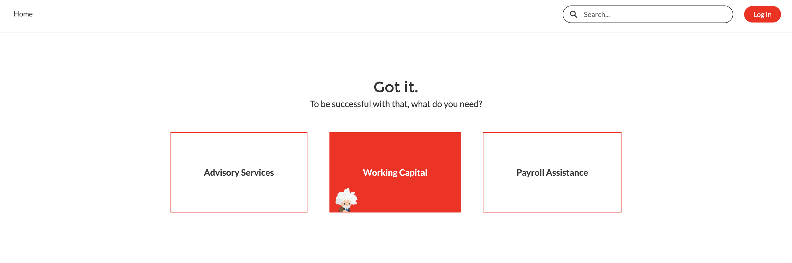

# Experience Cloud Prospect Flow

This Salesforce DX (SFDX) repository contains a Lightning Web Component designed specifically to be used for the new Experience Cloud for Marketing template. This flow is a slick way to capture interest and seamlessly register a prospect to being working with them in Experience Cloud for Customers.

# Preview

# Prereqs

In order to use this app, you'll need to ensure that you have...

* A Salesforce dev org
* Experience Cloud turned ON (with or without user licenses)
* Knowledge of SFDX
* Some JavaScript skills

NOTE: These components are for Experience Cloud (Communities) only.

## Deploy

Use SFDX, once connected to your Dev org's Dev Hub to deploy the source. The packaged LWCs are built entirely with vanilla JS, HTML, and CSS powered by the static resources included in the repo. The paired Apex classes will be deployed alongside these LWC.

You'll also need to do the following:

1. Make sure your CSP Trusted Settings allow for `https://fc-sfdc-public-assets.s3.us-east-2.amazonaws.com/`.

# Etc.

Created with love by Frank Caron.